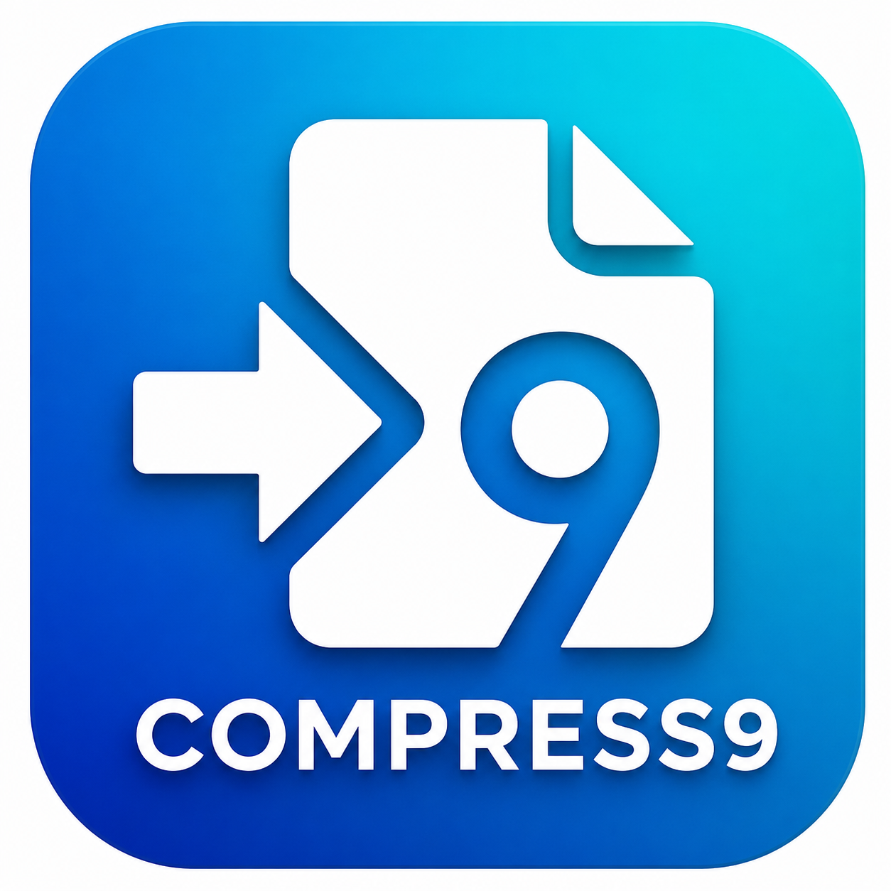

<p align="center">
  
</p>

<h1 align="center">Compress9</h1>

<p align="center">
  <strong>Video & Image Compression Tool for Android</strong>
  <br>
  Lightweight · Fast · Ads-Free · Open Source
</p>

<p align="center">
  <a href="https://github.com/glitchsumon/compress9/releases">
    
  </a>
  <a href="https://github.com/glitchsumon/compress9/blob/main/LICENSE">
    
  </a>
  <a href="https://github.com/glitchsumon/compress9">
    
  </a>
  <a href="https://github.com/glitchsumon/compress9/releases">
    
  </a>
  
  
</p>

---

## 📱 About

**Compress9** is a lightweight Android application designed to compress videos and images efficiently while preserving quality. Built with **Kotlin** and **Jetpack Compose**, it uses Android's native hardware-accelerated encoders for fast compression — no server required, everything runs on your device.

## ✨ Features

- **Video Compression** — MP4, MKV, AVI, MOV, 3GP & more
- **Image Compression** — JPG, PNG, WEBP & more
- **Fast Hardware Encoding** — Uses Android MediaCodec API (surface-based decode→encode pipeline)
- **Real-time Progress** — Progress bar with estimated time remaining
- **Fully Offline** — No internet required for compression
- **Ads-Free & Open Source** — No tracking, no ads, ever
- **Auto Update Check** — Notifies when a new version is available

## 📥 Download

Get the latest APK from the [Releases page](https://github.com/glitchsumon/compress9/releases).

Scan with your Android device:

```
https://github.com/glitchsumon/compress9/releases
```

**Requirements:** Android 7.0 (API 24) or higher.

## 🚀 How to Use

1. Open Compress9 and tap **Video** or **Image**
2. Choose a file from your device (gallery-first picker)
3. Adjust quality with the slider
4. Tap **Compress** and wait for it to finish
5. Find the output in **Movies/Compress9** or **Pictures/Compress9**

## 🛠 Tech Stack

| Component | Technology |
|-----------|-----------|
| Language | Kotlin 2.0 |
| UI Framework | Jetpack Compose (Material 3) |
| Video Encoding | Android MediaCodec API (surface mode) |
| Video Fallback | FFmpegKit (community fork) |
| Image Encoding | `Bitmap.compress()` |
| Architecture | Single-Activity, Navigation via state |
| Build System | Gradle with Kotlin DSL |

## 📁 Output Locations

- **Videos:** `Internal Storage/Movies/Compress9/`
- **Images:** `Internal Storage/Pictures/Compress9/`

Compressed files are immediately visible in the Gallery app.

## 🔧 Build from Source

```bash
git clone https://github.com/glitchsumon/compress9.git
cd compress9
./gradlew assembleRelease
```

The release APK will be at `app/build/outputs/apk/release/app-release.apk`.

## 📄 License

This project is licensed under the **MIT License** — see the [LICENSE](LICENSE) file for details.

## 👨‍💻 Developer

**Sumon**

- GitHub: [@glitchsumon](https://github.com/glitchsumon)
- Web: [compress9.cu.ma](https://compress9.cu.ma)

---

<p align="center">
  <i>Made with ❤️ and Kotlin</i>
</p>
